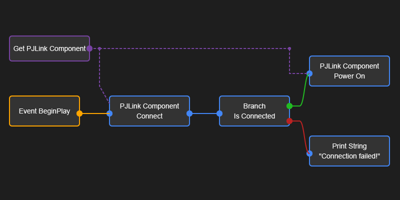
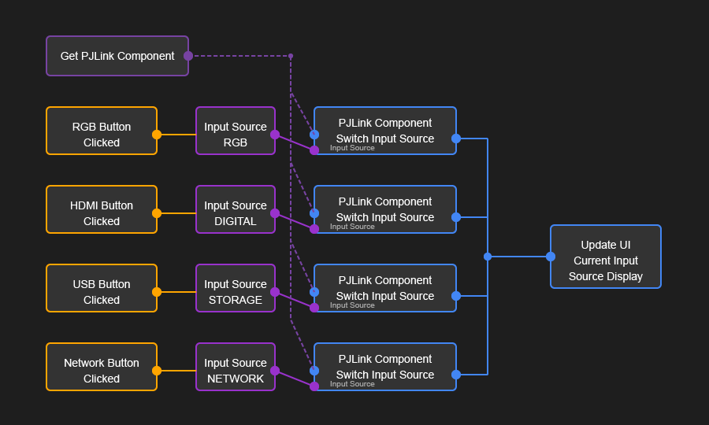

# PJLink 플러그인 블루프린트 가이드

## 개요
이 문서는 언리얼 엔진 5.5용 PJLink 플러그인의 블루프린트 사용 가이드입니다. 블루프린트에서 PJLink 프로토콜을 사용하여 프로젝터를 제어하는 방법에 대해 설명합니다.

## 시작하기

### 1. PJLink 컴포넌트 추가
1. 액터 블루프린트를 생성하거나 기존 액터를 선택합니다.
2. 컴포넌트 패널에서 "Add Component" > "PJLink Projector Component"를 선택합니다.
3. 새로 추가된 컴포넌트를 선택하고 Details 패널에서 설정을 구성합니다:
   - Projector Information: IP 주소, 포트, 인증 정보 등
   - Auto Connect at Start: 게임 시작 시 자동 연결 여부
   - Auto Reconnect: 연결이 끊어졌을 때 자동 재연결 여부

### 2. 이벤트 설정
PJLink 컴포넌트는 다양한 이벤트를 제공합니다:
- On Response Received: 명령 응답 수신
- On Power Status Changed: 전원 상태 변경
- On Input Source Changed: 입력 소스 변경
- On Connection Changed: 연결 상태 변경
- On Error Status: 오류 발생
- On Extended Error: 상세 오류 정보

이벤트 그래프에서 이러한 이벤트에 대한 핸들러를 추가할 수 있습니다.

### 3. 프로젝터 제어
PJLink 컴포넌트는 다음과 같은 제어 함수를 제공합니다:
- Connect: 프로젝터에 연결
- Disconnect: 프로젝터 연결 해제
- Power On: 프로젝터 전원 켜기
- Power Off: 프로젝터 전원 끄기
- Switch Input Source: 입력 소스 변경
- Switch Input Source By Index: 인덱스로 입력 소스 변경 (0: RGB, 1: VIDEO, 2: DIGITAL, 3: STORAGE, 4: NETWORK)
- Request Status: 프로젝터 상태 요청

## 상태 확인
프로젝터의 현재 상태를 확인하는 방법은 다음과 같습니다:

### 기본 상태 확인 함수
- Is Connected: 프로젝터 연결 여부 확인
- Is Projector Ready: 프로젝터가 사용 가능한 상태인지 확인
- Get Power Status: 전원 상태 가져오기
- Get Input Source: 입력 소스 가져오기

### 편의 함수
- Is Powered On: 전원이 켜져 있는지 확인
- Is Powered Off: 전원이 꺼져 있는지 확인
- Is Warming Up: 예열 중인지 확인
- Is Cooling Down: 냉각 중인지 확인
- Get Power Status As String: 전원 상태를 문자열로 가져오기
- Get Input Source As String: 입력 소스를 문자열로 가져오기
- Get Connection Status: 연결 상태 정보를 한 번에 가져오기

## 프리셋 관리
PJLink 컴포넌트는 프로젝터 설정을 프리셋으로 저장하고 불러오는 기능을 제공합니다:

### 프리셋 함수
- Save Current Settings As Preset: 현재 설정을 프리셋으로 저장
- Quick Save Preset: 현재 설정을 프로젝터 이름으로 빠르게 저장
- Load Preset: 저장된 프리셋 불러오기
- Load Preset By Index: 인덱스로 프리셋 불러오기
- Get Available Presets: 사용 가능한 프리셋 목록 가져오기
- Get Preset Display Names: 표시용 프리셋 이름 목록 가져오기

### 프리셋 관리 UI 예제

## 오류 처리
오류가 발생했을 때 대응하는 방법:
1. On Error Status 이벤트 사용
2. On Extended Error 이벤트로 더 상세한 오류 정보 받기
3. Get Last Error 함수로 마지막 오류 정보 확인
4. Generate Diagnostic Report 함수로 진단 보고서 생성
5. Generate Diagnostic Digest 함수로 간략한 진단 보고서 생성

## 예제 블루프린트

### 프로젝터 연결 및 전원 켜기

이 블루프린트는 다음을 수행합니다:
1. 게임 시작 시 프로젝터에 연결
2. 연결이 성공하면 프로젝터 전원 켜기
3. 전원 상태 변경 이벤트 처리

### 입력 소스 변경

이 블루프린트는 다음을 수행합니다:
1. UI 버튼을 통해 다양한 입력 소스 선택
2. 선택한 입력 소스로 전환
3. 입력 소스 변경 이벤트 처리 및 UI 업데이트

### 프리셋 관리

이 블루프린트는 다음을 수행합니다:
1. 프리셋 저장 및 불러오기 UI 제공
2. 드롭다운 메뉴를 통한 프리셋 선택
3. 현재 설정을 프리셋으로 저장

### 상태 모니터링 UI

이 블루프린트는 다음을 수행합니다:
1. 프로젝터 연결 상태 표시
2. 전원 상태 및 입력 소스 표시
3. 오류 메시지 표시

## 고급 기능

### 자동 재연결
프로젝터와의 연결이 끊어졌을 때 자동으로 재연결을 시도하는 기능입니다:
1. Auto Reconnect 옵션 활성화
2. Reconnect Interval 및 Max Reconnect Attempts 설정
3. Connection Changed 이벤트 처리

### 장시간 실행 시 안정성 향상
장시간 실행 시 안정성을 위한 설정:
1. Periodic Status Check 활성화
2. Status Check Interval 설정
3. 진단 데이터 수집 및 분석

### 진단 및 디버깅
문제 해결을 위한 진단 기능:
1. Verbose Logging 활성화
2. Generate Diagnostic Report 함수 사용
3. Communication Log 이벤트 처리
4. Debug Message 이벤트 처리

## 팁과 모범 사례

1. **연결 설정**
   - 연결 전에 항상 IP 주소와 포트가 올바른지 확인하세요.
   - 인증이 필요한 프로젝터의 경우 올바른 암호를 설정하세요.
   - Auto Connect 옵션은 신중하게 사용하세요. 프로젝터가 항상 사용 가능한 환경에서만 활성화하는 것이 좋습니다.

2. **상태 처리**
   - 명령을 보내기 전에 항상 Is Connected 및 관련 상태 함수를 사용하여 프로젝터 상태를 확인하세요.
   - 상태 변경 이벤트를 활용하여 UI를 자동으로 업데이트하세요.
   - Can Execute Command 함수를 사용하여 현재 상태에서 명령을 실행할 수 있는지 확인하세요.

3. **오류 처리**
   - 항상 On Error Status 및 On Extended Error 이벤트를 처리하여 사용자에게 피드백을 제공하세요.
   - 진단 보고서를 로그 파일에 저장하거나 UI에 표시하여 문제 해결에 활용하세요.

4. **성능 최적화**
   - 필요 이상으로 자주 상태를 확인하지 마세요. Status Check Interval을 적절히 설정하세요.
   - 디버깅이 필요한 경우에만 Verbose Logging을 활성화하세요.

5. **UI 설계**
   - 프로젝터 상태를 명확하게 표시하는 UI를 설계하세요.
   - 오류 메시지와 문제 해결 방법을 사용자에게 안내하세요.
   - 입력 소스 선택을 위한 직관적인 UI를 제공하세요.
