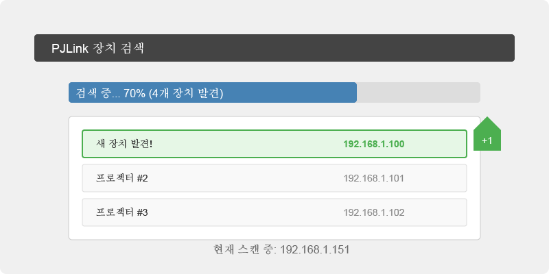
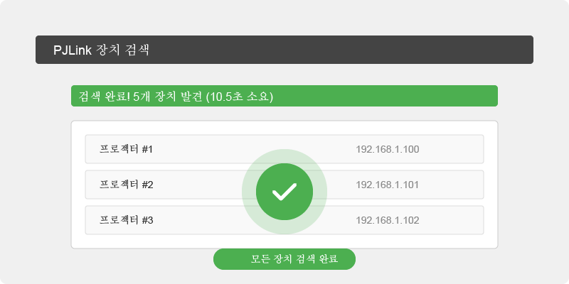
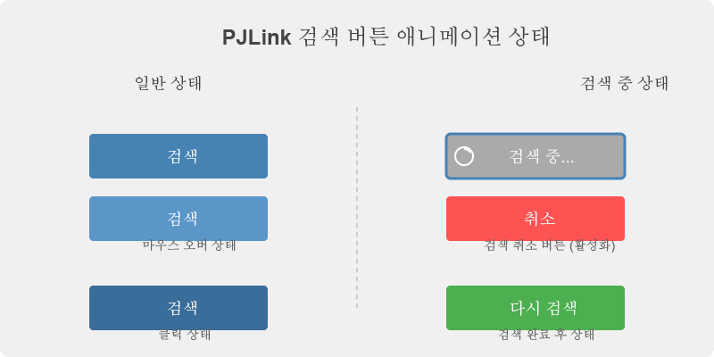

# PJLink 검색 UI 애니메이션 구현 가이드

## 개요
이 문서는 PJLink 플러그인의 검색 UI 애니메이션을 구현하는 방법을 설명합니다. PJLinkDiscoveryWidget 클래스에 정의된 애니메이션 이벤트를 활용하여 블루프린트에서 다양한 시각적 효과를 구현할 수 있습니다.

## 애니메이션 속성
PJLinkDiscoveryWidget 클래스에는 다음과 같은 애니메이션 관련 속성들이 있습니다:

```cpp
// 애니메이션 설정
UPROPERTY(EditAnywhere, BlueprintReadWrite, Category = "PJLink|Discovery|Animation")
float PulseAnimationDuration = 1.0f;

UPROPERTY(EditAnywhere, BlueprintReadWrite, Category = "PJLink|Discovery|Animation")
float DeviceFoundEffectDuration = 2.0f;

UPROPERTY(EditAnywhere, BlueprintReadWrite, Category = "PJLink|Discovery|Animation")
FLinearColor SearchingColor = FLinearColor(0.1f, 0.5f, 1.0f, 1.0f);  // 검색 중 색상 (파란색)

UPROPERTY(EditAnywhere, BlueprintReadWrite, Category = "PJLink|Discovery|Animation")
FLinearColor FoundColor = FLinearColor(0.1f, 0.8f, 0.2f, 1.0f);      // 발견 색상 (초록색)

UPROPERTY(EditAnywhere, BlueprintReadWrite, Category = "PJLink|Discovery|Animation")
float CompletionAnimationDuration = 3.0f;
```

## 애니메이션 이벤트
PJLinkDiscoveryWidget 클래스는 다음과 같은 애니메이션 이벤트를 제공합니다:

### 1. 프로그레스 애니메이션
- **StartProgressAnimation**: 검색 시작 시 호출됩니다.
- **StopProgressAnimation**: 검색 완료 시 호출됩니다.
- **UpdateProgressAnimation**: 검색 진행 상황에 따라 주기적으로 호출됩니다 (파라미터: `ProgressPercentage`).

### 2. 장치 발견 애니메이션
- **ShowDeviceFoundEffect**: 새로운 장치가 발견될 때 호출됩니다.
- 매개변수: `DeviceIndex` (발견된 장치의 인덱스), `EffectColor` (적용할 효과 색상)

### 3. 완료 애니메이션
- **PlayCompletionEffect**: 검색이 완료되거나 취소될 때 호출됩니다.
- 매개변수: `bSuccess` (성공 여부), `DeviceCount` (발견된 장치 수)

### 4. 검색 버튼 애니메이션
- **PlaySearchButtonAnimation**: 검색 버튼의 상태 변화에 따라 호출됩니다.
- 매개변수: `bIsStarting` (검색 시작 여부)

## 블루프린트 구현 예시

### 1. 프로그레스 애니메이션 구현


```
// StartProgressAnimation 이벤트에서:
PlayAnimation(SearchingSpinner);  // 회전 애니메이션 재생
SetVisibility(ScanningIcon, ESlateVisibility::Visible);

// StopProgressAnimation 이벤트에서:
StopAnimation(SearchingSpinner);
SetVisibility(ScanningIcon, ESlateVisibility::Hidden);

// UpdateProgressAnimation 이벤트에서:
// ProgressPercentage 파라미터를 사용하여 진행 정도에 따라 애니메이션 속도나 색상 조절
float SpinRate = FMath::Lerp(1.0f, 3.0f, ProgressPercentage / 100.0f);
SearchingSpinner.PlaybackSpeed = SpinRate;
```

### 2. 장치 발견 효과 구현



```
// ShowDeviceFoundEffect 이벤트에서:
if (ResultsScrollBox->GetChildrenCount() > DeviceIndex)
{
    UWidget* FoundItem = ResultsScrollBox->GetChildAt(DeviceIndex);
    
    // 항목 강조 효과
    PlayAnimation(PulseAnimation);
    
    // 색상 변경
    UWidgetComponent* Background = Cast<UWidgetComponent>(FoundItem->GetChildAt(0));
    if (Background)
    {
        Background->SetColorAndOpacity(EffectColor);
    }
    
    // 자동 스크롤하여 항목이 보이게 함
    ResultsScrollBox->ScrollWidgetIntoView(FoundItem, false);
    
    // 일정 시간 후 원래 색상으로 복원
    FTimerHandle ResetColorTimer;
    FTimerDelegate ResetColorDelegate;
    ResetColorDelegate.BindUFunction(this, "ResetItemColor", FoundItem);
    GetWorld()->GetTimerManager().SetTimer(ResetColorTimer, ResetColorDelegate, 1.0f, false);
}
```

### 3. 완료 애니메이션 구현



```
// PlayCompletionEffect 이벤트에서:
if (bSuccess)
{
    // 성공 효과 (녹색 펄스)
    PlayAnimation(SuccessAnimation);
    CompletionIcon->SetColorAndOpacity(FLinearColor(0.2f, 0.8f, 0.3f, 1.0f));
    
    // 발견된 장치 수에 따라 효과 크기 조절
    float EffectScale = FMath::Min(2.0f, 1.0f + (DeviceCount * 0.05f));
    CompletionIcon->SetRenderScale(FVector2D(EffectScale, EffectScale));
}
else
{
    // 실패/취소 효과 (주황색/빨간색 펄스)
    PlayAnimation(FailureAnimation);
    CompletionIcon->SetColorAndOpacity(FLinearColor(1.0f, 0.4f, 0.2f, 1.0f));
}

SetVisibility(CompletionPanel, ESlateVisibility::Visible);

// 일정 시간 후 효과 숨기기
FTimerHandle HideEffectTimer;
FTimerDelegate HideEffectDelegate;
HideEffectDelegate.BindUFunction(this, "HideCompletionEffect");
GetWorld()->GetTimerManager().SetTimer(HideEffectTimer, HideEffectDelegate, CompletionAnimationDuration, false);
```

### 4. 검색 버튼 애니메이션 구현



```
// PlaySearchButtonAnimation 이벤트에서:
if (bIsStarting)
{
    // 검색 시작 효과 (버튼 비활성화 및 시각적 표현)
    SearchButton->SetIsEnabled(false);
    SearchButtonText->SetText(FText::FromString("검색 중..."));
    PlayAnimation(SearchButtonPulse, 0.0f, 0.0f, EUMGSequencePlayMode::Forward, true);
}
else
{
    // 검색 종료 효과 (버튼 활성화 및 원래 상태로 복원)
    SearchButton->SetIsEnabled(true);
    SearchButtonText->SetText(FText::FromString("검색"));
    StopAnimation(SearchButtonPulse);
}
```

## 안내사항

1. 모든 애니메이션 이벤트는 블루프린트에서 재정의(override)할 수 있습니다.
2. 기본 구현에서는 애니메이션 효과가 적용되지 않으므로, 블루프린트에서 이벤트를 구현해야 합니다.
3. 애니메이션 관련 속성은 블루프린트 편집기에서 조정할 수 있습니다.
4. 검색 상태에 따라 적절한 애니메이션 효과를 적용하세요.
   - 검색 중: 회전 또는 펄스 애니메이션
   - 장치 발견: 강조 효과 또는 색상 변화
   - 검색 완료: 성공/실패에 따른 효과
5. UMG 애니메이션 시스템을 활용하면 더욱 풍부한 효과를 구현할 수 있습니다.

## 추가 팁

- 애니메이션 효과가 너무 과도하면 사용자 경험을 저해할 수 있으므로 적절한 수준으로 유지하세요.
- 색약/색맹 사용자를 고려하여 색상뿐만 아니라 형태나 크기 변화도 함께 사용하는 것이 좋습니다.
- 성능을 위해 복잡한 애니메이션은 최소화하고, 타이머를 적절하게 관리하세요.
- 장치 검색 중 진행 상황에 따라 애니메이션 속도나 강도를 조절하면 더 직관적인 피드백을 제공할 수 있습니다.
