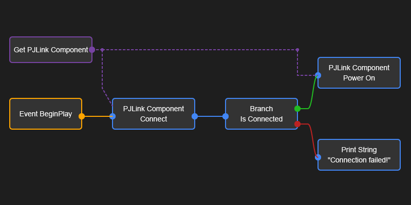
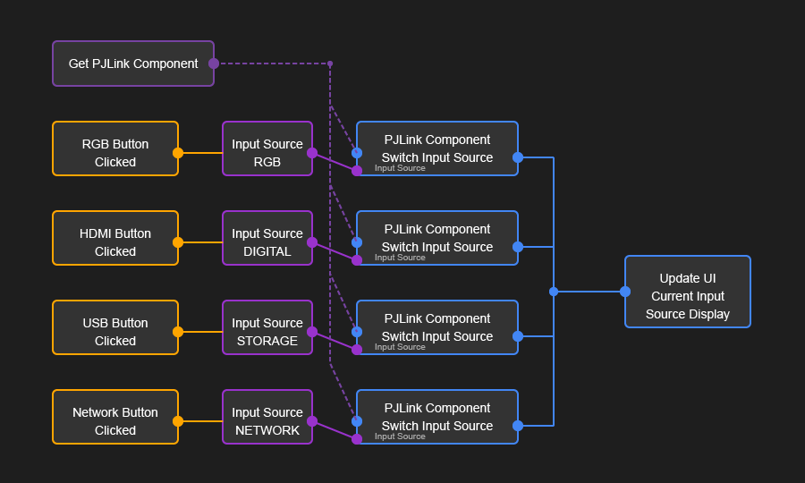

# PJLink 플러그인 블루프린트 가이드

## 개요
이 문서는 언리얼 엔진 5.5용 PJLink 플러그인의 블루프린트 사용 가이드입니다. 블루프린트에서 PJLink 프로토콜을 사용하여 프로젝터를 제어하는 방법에 대해 설명합니다.

## 시작하기

### 1. PJLink 컴포넌트 추가
1. 액터 블루프린트를 생성하거나 기존 액터를 선택합니다.
2. 컴포넌트 패널에서 "Add Component" > "PJLink Projector Component"를 선택합니다.
3. 새로 추가된 컴포넌트를 선택하고 Details 패널에서 설정을 구성합니다:
   - Projector Information: IP 주소, 포트, 인증 정보 등
   - Auto Connect at Start: 게임 시작 시 자동 연결 여부
   - Auto Reconnect: 연결이 끊어졌을 때 자동 재연결 여부

### 2. 이벤트 설정
PJLink 컴포넌트는 다양한 이벤트를 제공합니다:
- On Response Received: 명령 응답 수신
- On Power Status Changed: 전원 상태 변경
- On Input Source Changed: 입력 소스 변경
- On Connection Changed: 연결 상태 변경
- On Error Status: 오류 발생

이벤트 그래프에서 이러한 이벤트에 대한 핸들러를 추가할 수 있습니다.

### 3. 프로젝터 제어
PJLink 컴포넌트는 다음과 같은 제어 함수를 제공합니다:
- Connect: 프로젝터에 연결
- Disconnect: 프로젝터 연결 해제
- Power On: 프로젝터 전원 켜기
- Power Off: 프로젝터 전원 끄기
- Switch Input Source: 입력 소스 변경
- Request Status: 프로젝터 상태 요청

## 예제 블루프린트

### 프로젝터 연결 및 전원 켜기

이 블루프린트는 다음을 수행합니다:
1. 게임 시작 시 프로젝터에 연결
2. 연결이 성공하면 프로젝터 전원 켜기
3. 전원 상태 변경 이벤트 처리

### 입력 소스 변경

이 블루프린트는 다음을 수행합니다:
1. UI 버튼을 통해 다양한 입력 소스 선택
2. 선택한 입력 소스로 전환
3. 입력 소스 변경 이벤트 처리 및 UI 업데이트

## 프리셋 관리
PJLink 컴포넌트는 프로젝터 설정을 프리셋으로 저장하고 불러오는 기능을 제공합니다:
- Save Current Settings As Preset: 현재 설정을 프리셋으로 저장
- Load Preset: 저장된 프리셋 불러오기
- Get Available Presets: 사용 가능한 프리셋 목록 가져오기

## 오류 처리
오류가 발생했을 때 대응하는 방법:
1. On Error Status 이벤트 사용
2. On Extended Error 이벤트로 더 상세한 오류 정보 받기
3. Get Last Error 함수로 마지막 오류 정보 확인